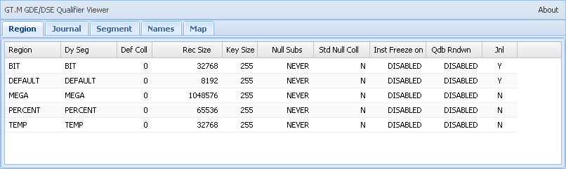
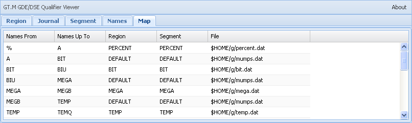

# GT.M GDE Qualifier show All for EWD Lite

Version 0.1.1 - 2013/07/29

## HIstory
 * 2013/07/29 add Free Count Tab, that is equal Do ^%FREECNT.

## About GDE Qualifier show All for EWD Lite

This EWD Lite application is equal GDE show -all command.
more details GDE show -all, See : chapter Global Directory Editor in GT.M Administration and Operations Guide
http://tinco.pair.com/bhaskar/gtm/doc/books/ao/UNIX_manual/gdecmds.html#gde_show

%FREECNT: Displays the number of free blocks in the database files associated with the current global directory.
http://tinco.pair.com/bhaskar/gtm/doc/books/pg/UNIX_manual/ch10s09.html#freecnt_percent

## Sample preView

## Environments:
 * OS : Ubuntu 12.04 or other Linux (eg. Red Hat, CentOS, etc)
 * GT.M : V6.0-001 Linux x86 & x8664 or late
 * Node.js : v 0.10.12  or late
 * EWD : Build 960 or late  (require %zewdJSON routine)
 * ewdGateway2 : Build 44 (09 July 2013)
 * NodeM : GT.M: Version: 0.2.1 (FWSLC)
 * Javascript framework : ExtJS 4.2 or late  (require)
 * Test browser : Google Chrome v 28.0.1500.72

## Configuring repository of gdeQualifier

     |-- m_routines                                                      
     |     +-- _nodemGTM2.m    GT.M function InitZgdeQualifier() 
     |-- node_modules                                                        
     |     +-- gdeQualifier.js back-end Node.js module                        
     +-- www                                                             
          |-- js  
          |   +-- gdeQualifier  
          |        |-- app.js   JavaScript app that out/in Websocket messages between UI and back-end  
          |        +-- ui.js    static JavaScript that describes the user interface (UI)  
          +-- ewd  
              |-- gdeQualifier  
                   +-- index.html  static HTML Page that provides the basic container  

Copy each files to setting up the EWD Lite Environment.  
Please refer to the Creating an EWD Lite Application chapter in EWD Lite Reference.  
http://gradvs1.mgateway.com/download/EWDLite.pdf  

## To Use:
  YouÅfll be asked for a password: use the one specified in the ewdgateway2 startup file. default is 'keepThisSecret!   

## Copyright and License
 
  Written by Kiyoshi Sawada <casiopea.tpine@gmail.com>  
  Copyright c 2013 Japan DynaSystems Inc.  
 
  This program is free software: you can redistribute it and/or modify it under the terms of the GNU Affero General Public License (AGPL) as published by the Free Software Foundation, either version 3 of the License, or (at your option) any later version.  
 
  This program is distributed in the hope that it will be useful, but WITHOUT ANY WARRANTY; without even the implied warranty of MERCHANTABILITY or FITNESS FOR A PARTICULAR PURPOSE. See the GNU Affero General Public License for more details. You should have received a copy of the GNU Affero General Public License along with this program. If not, see http://www.gnu.org/licenses/.

